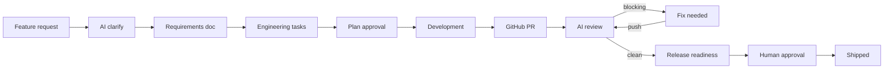

# ShipFlow AI

[](https://github.com/Ayush-Panda-design/AI-powered-Code-review/actions/workflows/ci.yml)

**From customer idea to shipped code — one calm thread your whole team can follow.**


| | |
|---|---|
| **Website** | [https://shipflowai.in](https://shipflowai.in) |
| **Live demo** | [https://ai-powered-code-review-web.vercel.app](https://ai-powered-code-review-web.vercel.app) |
| **Repository** | [Ayush-Panda-design/AI-powered-Code-review](https://github.com/Ayush-Panda-design/AI-powered-Code-review) |

---

## Why ShipFlow exists

Most teams already have GitHub, a backlog, and code review. What they lack is a **single line** from the original request through requirements, tasks, review, and release. ShipFlow AI fills that gap:

- **Planning** — turn vague requests into clarified requirements and engineering tasks  
- **Context** — tie every PR review back to what was approved for that feature  
- **Control** — humans approve the plan and the release; nothing ships without a yes  
- **GitHub-native** — sync PRs, post inline review comments, and run check runs where developers already work  

---

## How the delivery loop works



| Step | What happens |
|------|----------------|
| **Discover** | Capture ideas from the dashboard, customer intake page, or intake API (email, ticket, call) |
| **Clarify** | AI asks follow-up questions; replies can trigger the next clarification round; duplicates are flagged |
| **Plan** | Generate a requirements doc → break it into tasks → team approves the plan |
| **Build** | Connect GitHub repos, sync PRs, and link work to the parent feature |
| **Review** | AI reviews diffs against requirements and tasks — blocking vs non-blocking findings, inline comments, GitHub Checks |
| **Ship** | Release readiness summary → human approval → optional auto-merge of linked PRs → marked shipped |

---

## Tech stack

| Layer | Technology |
|-------|------------|
| Monorepo | Turborepo + pnpm |
| Web | Next.js 16, Shadcn UI |
| API | tRPC + server actions |
| Auth | BetterAuth (GitHub OAuth + email) |
| Database | Prisma + PostgreSQL (Neon) |
| Background jobs | Inngest (PR review, release readiness, crons, optional codegen) |
| GitHub | Octokit App + webhooks |
| AI | Vercel AI SDK + OpenRouter / Gemini |
| Vectors | Pinecone (optional PR context) |
| Billing | Razorpay monthly subscriptions (optional Pro plan) |

**Note:** Clarify, requirements, and task generation run **inline in the web app** (fast feedback in the UI). Inngest still powers PR reviews, release readiness, subscription expiry, and other background work.

---

## Project structure

```
my-app/
├── apps/
│   ├── web/          # Next.js dashboard, landing page, API routes
│   └── api/          # Express tRPC server (optional OpenAPI docs)
├── packages/
│   ├── database/     # Prisma schema + client
│   ├── services/     # Domain logic (features, credits, repos, billing)
│   └── trpc/         # tRPC routers
```

---

## Getting started

### Prerequisites

- Node.js 20+ (CI uses Node 24)
- pnpm 9+
- PostgreSQL (Neon recommended)
- GitHub OAuth App + GitHub App (installable on **any account** for multi-user demos)
- OpenRouter API key (for AI features)
- Inngest dev server (local) or Inngest Cloud (production, for PR reviews)

### Install

```bash
cd my-app
pnpm install
```

### Environment

Copy `apps/web/.env.example` to `apps/web/.env` and fill in values.

| Variable | Purpose |
|----------|---------|
| `DATABASE_URL` / `DIRECT_URL` | Neon pooled + direct Postgres URLs |
| `BETTER_AUTH_SECRET`, `BETTER_AUTH_URL` | Session auth (`BETTER_AUTH_URL` = `https://shipflowai.in` in production) |
| `GITHUB_CLIENT_ID`, `GITHUB_CLIENT_SECRET` | OAuth sign-in |
| `GITHUB_APP_ID`, `GITHUB_APP_NAME`, `GITHUB_APP_PRIVATE_KEY`, `GITHUB_WEBHOOK_SECRET` | Repo access + webhooks |
| `OPENROUTER_API_KEY` | AI clarify, requirements, tasks, review |
| `GEMINI_API_KEY` | Optional faster codegen |
| `INNGEST_DEV=1` | Local background jobs |
| `INNGEST_EVENT_KEY`, `INNGEST_SIGNING_KEY` | Production Inngest |
| `SHIPFLOW_INTAKE_SECRET` | Bearer token for intake API |
| `RAZORPAY_*` | Optional Pro monthly subscription |
| `PINECONE_*` | Optional vector context for reviews |

### Database

```bash
pnpm db:deploy    # apply migrations (production-safe)
pnpm db:generate  # regenerate Prisma client
```

### Run locally

```bash
# Terminal 1 — Next.js
pnpm dev

# Terminal 2 — Inngest dev server (PR reviews & crons)
pnpm inngest:dev
```

Open [http://localhost:3000](http://localhost:3000) → sign in → install the GitHub App → create a feature request.

### Tests

```bash
pnpm test
```

Covers workflow constants, review comment utilities, and API rate limiting.

---

## Demo path (for judges)

Suggested 5-minute walkthrough on [shipflowai.in](https://shipflowai.in):

1. **Landing** `/` — product story; signed-in users see **Go to dashboard**
2. **Sign in** `/sign-in` — GitHub (full repo access) or email (planning-only until GitHub is connected)
3. **Overview** `/dashboard` — pipeline stats at a glance
4. **Feature request** `/dashboard/feature-requests` — create a request with a source tag
5. **Customer intake** `/dashboard/intake` — simulate email / ticket / call (auto-starts clarify)
6. **Clarify → Requirements → Tasks** — run AI on the feature detail page (completes in the browser, ~15–60s per step)
7. **Approve plan** when status is *Awaiting plan approval*
8. **Requirements** `/dashboard/prd` — edit the generated doc
9. **Task board** `/dashboard/tasks` — kanban columns
10. **GitHub App** `/dashboard/github-app` — install on your account (app must allow **any account**)
11. **Repositories** `/dashboard/repositories` — connect repos to a project
12. **Pull requests** `/dashboard/pull-requests` — sync, link to features, AI review (needs Inngest in production)
13. **Release approval** `/dashboard/approvals` — human ship gate
14. **Shipped** `/dashboard/shipped` — archive of approved features
15. **Workspaces** `/dashboard/workspaces` — switch teams

### Demo video

Record a 3–5 minute walkthrough following the path above and add the link here:

`[Demo video URL — YouTube / Loom]`

---

## Intake API (email / ticket / call)

```bash
curl -X POST https://shipflowai.in/api/intake/feature-request \
  -H "Authorization: Bearer $SHIPFLOW_INTAKE_SECRET" \
  -H "Content-Type: application/json" \
  -d '{
    "workspaceId": "your-workspace-id",
    "title": "Add dark mode",
    "description": "Users want a dark theme toggle in settings",
    "source": "email"
  }'
```

Validated with Zod; rate-limited to 30 requests/minute per IP.

---

## GitHub integration

Two separate GitHub integrations — do not mix them up:

| Purpose | Type | Callback URL |
|---------|------|--------------|
| User sign-in | OAuth App | `https://shipflowai.in/api/auth/callback/github` |
| Repo access | GitHub App | `https://shipflowai.in/api/github/callback` |

**Webhook URL:** `https://shipflowai.in/api/github/webhook`

**GitHub App settings for demos:** set *Where can this GitHub App be installed?* to **Any account** so judges and teammates can connect their own GitHub.

**Permissions required:** `Contents: Read & write` (merge on ship), `Pull requests: Read & write`, `Checks: Read & write`, `Metadata: Read`.

**Events:** `pull_request`, `installation`, `installation_repositories`.

AI reviews post **inline PR comments**, a summary, and a **GitHub Check** (`ShipFlow AI Review`) that passes or fails based on blocking findings. On human release approval, linked PRs are **squash-merged** when mergeable.

---

## Razorpay subscriptions

Pro is a **monthly Razorpay subscription**:

1. Checkout via `/api/razorpay/checkout`
2. Client verifies `razorpay_subscription_id` + payment signature
3. Webhooks: `subscription.activated`, `subscription.charged`, `subscription.cancelled`
4. Daily Inngest cron downgrades workspaces when `currentPeriodEnd` passes

---

## Inngest workflows

| Function | Trigger | Purpose |
|----------|---------|---------|
| `clarify-feature-request` | `shipflow/feature.clarify` | Intake auto-clarify (UI uses sync path) |
| `generate-prd` | `shipflow/prd.generate` | Legacy / API fallback |
| `generate-tasks` | `shipflow/tasks.generate` | Legacy / API fallback |
| `review-pull-request` | `github/pr.received` | Requirements-aware AI review |
| `check-release-readiness` | `shipflow/release.readiness` | Pre-ship summary |
| `generate-task-code` / `open-task-draft-pr` | task events | Optional AI codegen |
| `check-stale-pull-requests` | cron every 6h | Stale PR nudges |
| `syncGitHubPullRequests` | `github/sync.requested` | Background sync (UI also has direct sync) |
| `check-expired-subscriptions` | cron daily | Downgrade expired Pro |

---

## AI capabilities

| Feature | Description |
|---------|-------------|
| Clarification agent | Follow-up questions, duplicate detection, repo context |
| Requirements generation | Problem, goals, scope, user stories, acceptance criteria |
| Task breakdown | Kanban-ready engineering tasks from approved requirements |
| Requirements-aware review | Blocking vs non-blocking findings with suggestions |
| Re-review delta | Compares findings across review rounds |
| Release readiness | Ship / no-ship assessment before human approval |
| Review learning | False-positive rules and muted categories |
| Optional codegen | AI draft PRs per task (Gemini) |

---

## Database (high level)

Prisma schema: `packages/database/prisma/schema.prisma`

- **Auth:** `User`, `Session`, `Account`
- **Multi-tenant:** `Workspace`, `WorkspaceMember`, `WorkspaceInvite`, `Subscription`
- **Delivery:** `Project`, `FeatureRequest`, `ClarificationMessage`, `PRD`, `Task`
- **GitHub:** `GitHubInstallation`, `ConnectedRepository`, `PullRequest`, `SyncRun`
- **Review:** `AIReview`, `ReviewRule`, `ReleaseApproval`, `PlanApproval`
- **Billing:** `RazorpayCheckoutOrder`
- **Audit:** `ActivityEvent`

---

## Deployment (Vercel)

- **Root directory:** `my-app`
- **Build:** `pnpm build` (Turborepo)
- **Custom domain:** [shipflowai.in](https://shipflowai.in) → point DNS to Vercel; set `BETTER_AUTH_URL=https://shipflowai.in`
- Copy all env vars from `.env.example`
- Run `pnpm db:deploy` against production before first deploy
- Connect [Inngest Cloud](https://www.inngest.com) with production signing keys for PR reviews

---

## License

MIT — ChaiCode hackathon submission.

**Builder Mode On | iPhone Giveaway Hackathon** `#chaicode`
